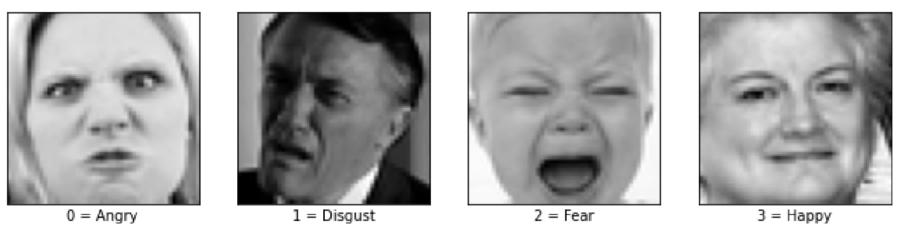
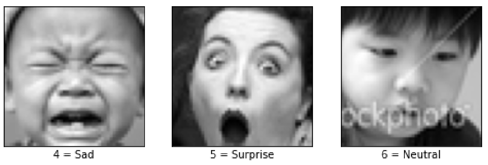
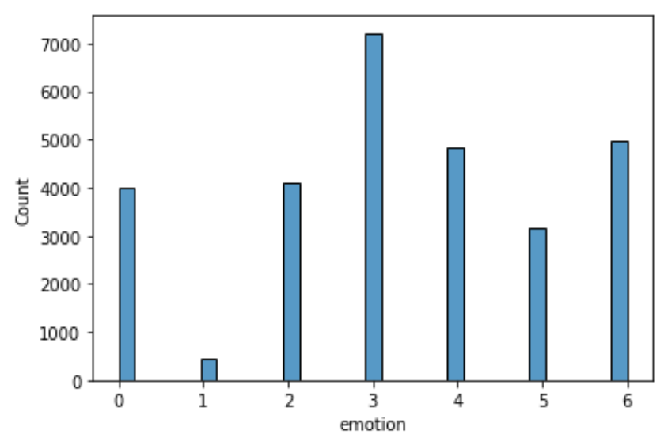
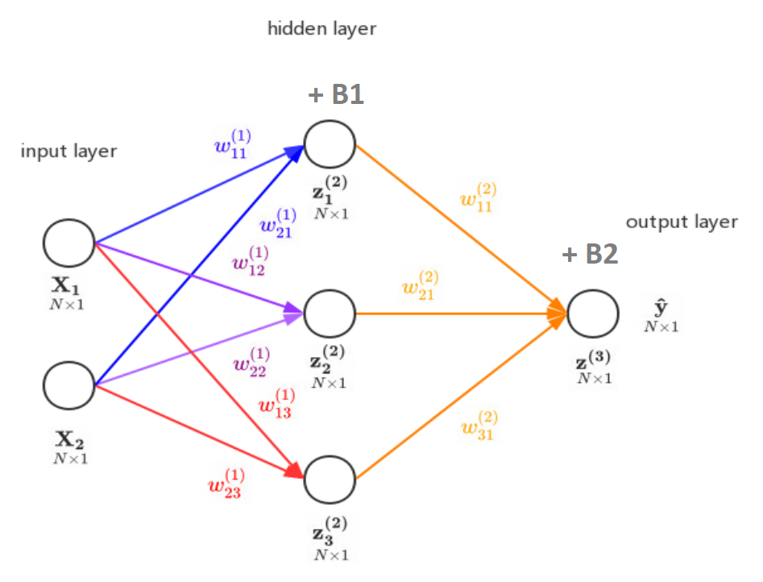
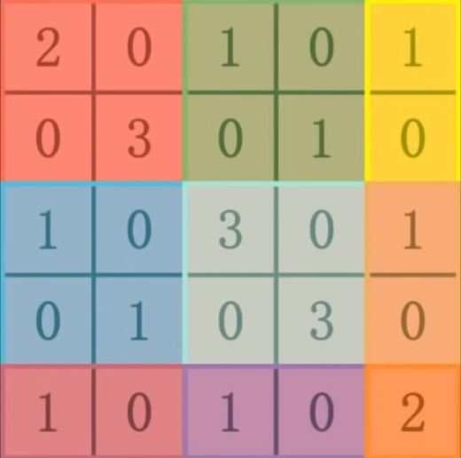
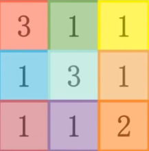

# Facial Emotion Recognition
*Authors*: [Alan Wang]([baidu.com](https://github.com/alanwmy00), Amy Tang, Isaac No, Joy Richardson, [Philip Huang](https://github.com/philhuang74), Tim Chen  
[Data](Data/face.csv), [Code](FacialEmotionRecognition.ipynb), [Presentation](Facial%20Emotion%20Recognition.pptx)

Table of Contents:
- [Facial Emotion Recognition](#facial-emotion-recognition)
  - [Abstract](#abstract)
  - [1. Introduction](#1-introduction)
    - [1.1 Dataset](#11-dataset)
    - [1.2 Data Preprocessing & Exploratory Data Analysis](#12-data-preprocessing--exploratory-data-analysis)
  - [2. Modeling](#2-modeling)
    - [2.1 Naive Bayes Classifier](#21-naive-bayes-classifier)
    - [2.2 Logistic Regression](#22-logistic-regression)
    - [2.3 K-means + Logistic Regression](#23-k-means--logistic-regression)
    - [2.4 K-Nearest Neighbors with PCA + CV](#24-k-nearest-neighbors-with-pca--cv)
    - [2.5 Random Forest](#25-random-forest)
    - [2.6 Support Vector Machine with PCA](#26-support-vector-machine-with-pca)
    - [2.7 Artificial Neural Network](#27-artificial-neural-network)
    - [2.8 Convolutional Neural Network](#28-convolutional-neural-network)
  - [3. Conclusion](#3-conclusion)
    - [3.1 Results](#31-results)
    - [3.2 Afterword](#32-afterword)
  - [4. Cited Works](#4-cited-works)

## Abstract

With the exponential progress in artificial intelligence, one particular field that has been in development is facial emotion recognition. Much research today revolves around the deep learning process in recognizing something as abstract as human emotions. This process serves to have several types of complications based upon detecting specific facial features within a given set of parameters. There are many applications for this technology including, but not limited to, personalized advertisements based on customer satisfaction, percepting certain behaviors within given environments, and recreating or simulating actions for further purposes. Considering these applications, several classification methods serve to have higher efficiencies in processing given information while reaching a solvable state – a correct recognition and categorization. This research report aims to explore these differences, primarily focusing on the process of implementing the models and their achieved results.

Our group builds a facial emotion recognition machine learning model. We explore classification methods such as Naive Bayes Classifier, Logistic Regression, KNN, Random Forest, and SVM using scikit-learn. In addition, we perform cross validation to find the optimal hyperparameters in increasing efficiency or decreasing the margin of error. In the end, we implement an artificial neural network and a convoluted neural network in TensorFlow for such classification. Overall, we will utilize each of our models on the validation set and the testing set and use accuracy as the metric of the performance of each model.

## 1. Introduction

### 1.1 Dataset

Our task is therefore to train a multi-class classification model for facial emotion recognition.

For our purposes, we use a dataset of grayscale faces, from a Kaggle competition dataset by Aaditya Singhal. Our dataset consists of 28709 faces, with each face consisting of 48 by 48 pixels, and each pixel is a value from 0 to 255. Each face is also centered and occupies similar space throughout the dataset.

There are seven facial expressions covered in this dataset, represented with numeric labels, and the expressions for the labels are shown in the table below:

$$
\begin{array}{|c|c|}
\hline \textbf { Label } & \textbf { Emotion } \\
\hline 0 & \text { Angry } \\
\hline 1 & \text { Disgust } \\
\hline 2 & \text { Fear } \\
\hline 3 & \text { Happy } \\
\hline 4 & \text { Sad } \\
\hline 5 & \text { Surprise } \\
\hline 6 & \text { Neutral } \\
\hline
\end{array}
$$

The following are one image from each of the seven categories:

### 1.2 Data Preprocessing & Exploratory Data Analysis

The pixel information is stored as string in the original dataset, which is not trainable by any classifier. Thus, we cast each of them to an array of integers of length 2304, which represents all 48 by 48 pixels. Therefore, the number of features we have is 2304. For the purpose of training a convolutional neural network in Section 2.8 of this report, we will also keep a copy of the dataset with each image information stored as a 3-dimension 48 by 48 by 1 array of integers.

Normalization is one trick widely used in machine learning to improve the performance of certain models, as the great difference in the scale of the numbers could cause problems when attempting to combine the values as features during modeling, and the problem is especially serious when training a neural network. We therefore normalize all data points to mean 0 and standard deviation 1.

To discuss the performance of a model, we need to define the metrics first. Although metrics such as F-score more accurately captures the performance of a model by looking at both precision and recall, for a multi-class classification problem, we have to compute the per-class F-score: for the i-th class, F-score is defined as:
$$F_i  = 2 \times (\textit{precision}_i×\textit{recall}_i) \ /\  (\textit{precision}_i+\textit{recall}_i) $$

and then take the average of all per-class F-scores to get the macro F-score:
$$\textit{macro}\ F =  \frac{1}{k} \cdot ∑_{i = 1}^k F_i$$

For deep learning libraries such as Tensorflow, such definition is enough for the moment as we can simply add an additional metric \`macro f1\`, but for traditional machine learning algorithms, macro F-score is not integrated: by default, calling the \`score\` function would calculate the accuracy. Thus, for convenience, we decide to use accuracy as our metrics, which is defined as: $$accuracy =\frac{\# \text { of correct predictions }}{\# \text { of total predictions }}$$

Although accuracy is easier to calculate and implement in practice, we also need to ensure that we have a balanced dataset – in the case of a extremely imbalanced dataset, the model can just predict any input to the most dominant label and reach a high accuracy, even when the model is not good at all under any other metrics. Therefore, we first plot a histogram of count of labels:

The dataset is quite balanced, except for label 1 “Disgust” and label 3 “Happy”. We can overcome this issue by either oversampling the low-cost classes or subsampling the high-cost classes. For our project, since label 1 only has 436 instances, applying subsampling would result in insufficient training data. However, we only do this for the training set - we separate the validation set and the test set out before this step - as we have to keep the validation set and the test set “unseen” by the model when training. We apply both to the training set: either oversample or subsample each class so that each label has 3,000 instances. The validation set is used for preventing overfitting. We will use the same validation and testing data throughout the project to compare the performance on unseen data of various models.

## 2. Modeling

### 2.1 Naive Bayes Classifier

Naive Bayes is a set of methods using the Bayes classifier to perform supervised learning. The Bayes classifier is a probabilistic model of the form

$$
P\left(y \mid x_{1}, \ldots, x_{n}\right)=\frac{P(y) P\left(x_{1}, \ldots, x_{n} \mid y\right)}{P\left(x_{1}, \ldots, x_{n}\right)}
$$

where y is the class variable and $x_1$ through xn are various features. The “naive” assumption of Bayes is based on strong independence between the features $x_1, ..., x_n$. In other words, the covariances are assumed to be 0. It does not take into account the weight of one variable over another. For example, if trying to classify an orange, the classifier may take into account color, shape, and size. So a round, orange object with a diameter of approximately 3 inches would be considered an orange. The features color, shape, and size are assumed to contribute equally to the probability that this object is an orange. In this sense, all x variables are equally important to determining y.

Despite the simplicity of the classifier, Naive Bayes works well in real world situations as a document classifier and spam filter. It only requires a small amount of training data and is very fast. On the other hand, though it works well as a classifier, Naive Bayes performs poorly as an estimator, which is why we use it for classification purposes only.

Using scikit-learn in Python, we performed Gaussian Naive Bayes on our dataset. The model performed poorly, with training accuracy of 23% and validation and test accuracy at 20 and 21%, respectively. The confusion matrix also shows that the classifier did not work very well, with low values across the main diagonal. The values that were predicted with the best accuracy of 0.61 and 0.38 were expressions of surprise and sadness. Overall, the Naive Bayes classifier performed poorly on our dataset.

### 2.2 Logistic Regression

Logistic regression is a linear model for classification. In particular, it is a resourceful supervised machine learning algorithm used for binary classification problems, in which the target can be categorized. Not only is it an easy method to use to model the probability of a discrete outcome given an input, as opposed to linear regression, this method does not need to have a linear relationship between inputs and corresponding outputs. This is particularly due to its characteristic of utilizing a logistic function, which is bounded between 0 and 1, to which a nonlinear log transformation is applied to the odds ratio.

The logistic regression model can be represented by
$$
p\left(C_{1} \mid \phi\right)=y(\phi)=\sigma\left(w^{-T} \phi\right) \text { such that } \sigma(a)=\frac{1}{1+\exp (-a)}
$$

which is known as the logistic sigmoid function.

Furthermore, logistic regression minimizes the following cost function:
$$\min _{w,\ c} \frac{1}{2} w^{T} w+C \sum_{i=1}^{n} \log \left(\exp \left(-y_{i}\left(X_{i}^{T} w+c\right)\right)+1\right)$$

We use scikit-learn log regression package to run our data after cross validation separation. Logistic regression enables us to find the probability of new test data belonging to each class (in this case, supervised since we already have 7 groups of emotions). In general, we have 7 probability results for each new test data, and we put the new datapoint to the group of the highest probability.

This process continues for all test data, and we get a result for our final analysis. The score reported by constructing the code and functions imported in the library, we can also compute the normalized confusion matrix, which is a direct graphical representation of how well the model is.

The overall accuracy score of 0.35 means logistic regression is probably not the best model, but still an improvement compared to random guessing.

### 2.3 K-means + Logistic Regression

K-means is a clustering algorithm which splits certain data into k amounts of clusters. As the number of clusters can be changed by the user, for our purposes, we use this method to divide the data as a parameter for the logistic regression method, which was defined earlier.

Much like that of what was described for the logistic regression model, the process is similar with the exception that we set a finite value to split the data into k number of clusters before moving onto calling logistic regression. K-means was also implemented through the usage of scikit-learn through Python. Since there are approximately five different ways in which people express each emotion, we get $k = 5 \cdot 7 = 35$ to split the data for logistic regression.

However, the results were drastically different to that of logistic regression. In fact, in our case the accuracy of classifying the images correctly (under the “accuracy” metric) was significantly lower than the latter. Beside the factor of randomness, one other assumption for this result may have been due to the split in data that occurred before implementing logistic regression, in which the sets of images were truncated within the process.

### 2.4 K-Nearest Neighbors with PCA + CV

K-nearest neighbors, or KNN, is a supervised learning method used for both classification and regression. The training data is labeled with a class, then the algorithm iterates through each point to find the closest neighboring points. Distance can be measured using Euclidean, kernelized, and other methods of measuring distance. The classes of the k closest points are considered, and a majority-rule method of voting occurs. For example, say a point is waiting to be classified. Its 2 closest neighbors are classified as red. However, its next 3 closest neighbors are all classified as blue. Choosing $k = 2$ would result in the classification “red”, while $k = 5$ would classify the point as blue. Choice of k is arbitrary, but a common method is to use $k = \sqrt n$, where n is the number of observations in the data. A smaller k is more sensitive to noise in the data, while a larger k is more computationally expensive and often results in lower complexity (a “smoother” boundary).

We use principal component analysis (PCA) to reduce the dimensions of the data. KNN is computationally expensive with large datasets, as distances must be computed and sorted. PCA is a statistical method that uses an orthogonal transformation to convert a set of observations of many correlated variables into a smaller set of linearly uncorrelated variables called principal components. It is used for dimensionality reduction by projecting each data point onto only the principal components. This way, the dimensionality of the data is reduced while still preserving as much variation of the data as possible. PCA attempts to keep only the most “important” parts of the data while discarding as much fluff as possible.

### 2.5 Random Forest

The random forest model consists of a large number of individual decision trees, where it altogether operates as an ensemble. Based on each prediction produced by the decision trees, the greatest value becomes the entire model’s prediction. In other sense, the random forest model operates as a set of individualized – not necessarily correlated – tasks that come together in the end. In order for the model to perform well, it must be implemented with specified parameters that prevent random guessing and each individual prediction must not have a lot of correlation to another. As it has many decision trees by its core, the random forest model is unable to find patterns that allow it to extrapolate values that do not exist in the training set.

As explained in the definition of the random forest model, it consists of many decision trees. Through scikit-learn using Python, we are able to implement the model by considering the Gini impurity – an important measure that is used to construct multiple decision trees. Not only is it simple to implement, it works better with bigger distributions of values that may or may not be diverse. The following is the equation:
$$\sum_{i=1}^{C}  p_{i}\left(1-p_{i}\right)$$

where $p$ is the frequency of the i-th node and $C$ is the value relating to unique nodes.

However, despite our expectation that multiple decision trees would be constructed well within the random forest model, the model unfortunately produced a result that fell below our expectations. One assumption attributing to its overall inaccuracy is due to the fact that, by definition, a decision tree follows a binary pattern in discerning one part of the data from the other. For this reason, even if each individual decision tree within the random forest model operated separately without any bias or with a significant amount of correlation between all trees, the one with the best prediction is still limited by the reason mentioned. It is also noted here that even if we tried to use a decision tree with CV, it would take forever to process through all of the data.

### 2.6 Support Vector Machine with PCA

The Support Vector Machine, also known as the SVM, is a way to classify data points by using a linear boundary. It tries to maximize the margin of the support vectors and is very useful along with PCA. Sometimes, to create a linear boundary for non-linear data, we utilize kernelized SVM:

$$
K\left(\mathbf{x}, \mathbf{x}^{\prime}\right)=\exp \left(-\frac{\left\|\mathbf{x}-\mathbf{x}^{\prime}\right\|^{2}}{2 \sigma^{2}}\right)
$$

where we project the data into a higher dimension to then be able to separate data points with a linear hyperplane.

In our case, covariance matrix is (performed by scikit-learn) calculated by

$$\frac{1}{n-1} \sum_{i=1}^{n}\left(x_{i j}-\bar{x}_{j}\right)\left(x_{i k}-\bar{x}_{k}\right)$$

Selecting eigenvectors of this covariance matrix means getting a reduced version (eigenimage) of the original faces, and we project each instance to such an eigenspace spanned by 50 (we used a rough estimate of 50) eigenvectors, hugely reduced the dimension from 2304 (48 by 48) to 50. We can use the reconstruction step to project the 50-dimension dataset back to the original space to see the before and after effect of PCA. After we retrieve the 50-D dataset, we implement the SVM, which projects features to higher dimensions, using the default radial basis function kernel algorithm.

Radial Basis function in general form: with denominator replaced by $- n_{\text{features}} \cdot Var (x)$ instead in our case.

### 2.7 Artificial Neural Network

The Artificial Neural Network (ANN) is a deep learning algorithm that emerged and evolved from the idea of biological neural networks of human brains. An attempt to simulate the workings of the human brain culminated in the emergence of ANN. ANN works very similar to the biological neural networks.

The basic unit of computation in a neural network is the neuron , often called a node or unit. It receives input from some other nodes, or from an external source and computes an output. Each input has an associated weight (w), which is assigned on the basis of its relative importance to other inputs. The node applies a function to the weighted sum of its inputs.

We define a neural network through multiple layers of nodes, each layer also encodes an activation function: a non-linear transformation to allow for more complexities in the relationship. For instance, we can represent the following neural network:

with the following set of equations:

$$
\begin{gathered}
\underset{N \times 4}{\mathbf{X}} \mathbf{W}_{4 \times 3}^{(1)}+\underset{N \times 1}{\mathbf{J}} \mathbf{B}_{1 \times 3}^{(1) T}=\mathbf{z}_{N \times 3}^{(2)} \\
f\left(\mathbf{z}_{N \times 3}^{(2)}\right)=\underset{N \times 3}{\mathbf{a}^{(2)}} \\
\underset{N \times 3}{\mathbf{a}^{(2)}} \mathbf{W}_{3 \times 3}^{(2)}+\underset{N \times 1}{\mathbf{J}} \mathbf{B}_{1 \times 3}^{(2) T}=\underset{N \times 3}{\mathbf{z}^{(3)}} \\
f\left(\mathbf{z}_{N \times 3}^{(3)}\right)=\underset{N \times 3}{\hat{\mathbf{y}}}
\end{gathered}
$$

This step is referred to as “forward propagation”. By defining a loss function, we can then calculate the loss between the predicted values y hat and the true values y:
$$
\mathcal{J}=\frac{1}{2} \sum_{n}\left(y_{n}-\hat{y}_{n}\right)^{2}
$$

We can then perform “backward propagation”, find the gradient of the loss function with respect to each weight and bias matrix, and perform gradient descent. For our example, the gradient are as follows:
$$
\begin{gathered}
\frac{\partial J}{\partial W^{(2)}}=\mathbf{a}^{(2) T} \delta^{(3)} \\
\frac{\partial J}{\partial B^{(2)}}=\delta^{(3) T} 1_{N \times 1} \\
\frac{\partial J}{\partial W^{(1)}}=\mathbf{X}^{T} \delta^{(2)} \\
\frac{\partial J}{\partial B^{(1)}}=\delta^{(2) T} 1_{N \times 1}
\end{gathered}
$$

where

$$
\begin{gathered}
\delta^{(3)}=-(\mathbf{y}-\hat{\mathbf{y}}) \odot f^{\prime}\left(\mathbf{z}^{(3)}\right) \\
\delta^{(2)}=\delta^{(3)}\left(\mathbf{W}^{(2)}\right)^{T} \odot f^{\prime}\left(\mathbf{z}^{(2)}\right)
\end{gathered}
$$

where $\odot$ represents element wise multiplication.

By iterating forward and backward propagation, the model learns the best parameters.

In our dataset, we feed the flattened normalized pixels into the neural network with 7 output nodes, where each node represents the probability of expressing one facial expression. We take the argmax of the 7 output to determine the most likely facial expression, which is our result.

### 2.8 Convolutional Neural Network

All the methods discussed from section 2.1 to 2.6 are more generalized classification models, but the convolutional neural network is specifically designed for image classification. Compared to other models, CNN looks at the relationship between pixels and determines if a certain feature exists at a certain location through the use of convolution kernels. Suppose we have a picture of an “X”, binary and 7 by 7, represented by the matrix below:

$$X=\left(\begin{array}{lllllll}0 & 0 & 0 & 0 & 0 & 0 & 0 \\ 0 & 1 & 0 & 0 & 0 & 1 & 0 \\ 0 & 0 & 1 & 0 & 1 & 0 & 0 \\ 0 & 0 & 0 & 1 & 0 & 0 & 0 \\ 0 & 0 & 1 & 0 & 1 & 0 & 0 \\ 0 & 1 & 0 & 0 & 0 & 1 & 0 \\ 0 & 0 & 0 & 0 & 0 & 0 & 0\end{array}\right) \in \mathbb{R}^{7 \times 7}$$

If we want to detect the feature dignonal, we can represent the feature with a 3 \* 3 identity matrix, called convolution kernel:

$$
I=\left(\begin{array}{lll}
1 & 0 & 0 \\
0 & 1 & 0 \\
0 & 0 & 1
\end{array}\right) \in \mathbb{R}^{3 \times 3}
$$

We can then detect the abundance of this feature in this matrix, call it A:

$$A \in \mathbb{R}^{5\times5} \text{, where }A_{i,\ j} = X[i:i+2, j:j+2] \cdot I, \text{where } i,j \in \{1,2,3,4,5\} $$

where $\cdot$ represents matrix dot product, so:

$$A=
\left(\begin{array}{lllll}
2 & 0 & 1 & 0 & 1 \\
0 & 3 & 0 & 1 & 0 \\
1 & 0 & 3 & 0 & 1 \\
0 & 1 & 0 & 3 & 0 \\
1 & 0 & 1 & 0 & 2
\end{array}\right)
$$

The greater the value is, the more abundant this feature exists in the original picture. We can of course use more than one convolution kernel to detect various features; however, the resulting matrix (or tensor if we use more than one) might become too large, resulting in a slow training speed. Therefore, one way to solve this problem is through pooling. In practice, max pooling and average pooling is most often used. It maintains the original feature distribution while significantly reducing the size of the matrix/tensor. The result of performing max pooling on our matrix *A* can is shown below:

As discussed in Section 1.2, normalization is a trick widely used in machine learning. We can therefore normalize the pooled matrix by sigmoid function and obtain:

$$
B = \text{sigmoid(pooled(A))}=\left(
\begin{array}{ccc}
0.95 & 0.73 & 0.73 \\
 0.73 & 0.95 & 0.73 \\
 0.73 & 0.73 & 0.88
\end{array}
\right)
$$

This step is referred to as “activation”. Various other activation functions such as “ReLU” can also be adopted.

Through iteration of applying convolution kernels, pooling, and activation, we are able to capture nearly all features of an image, and through the process of flattening, we transform the matrix/tensor to a one-dimensional vector and feed it to the artificial neural network discussed in Section 2.7.

In actual implementation, the process of choosing the optimal convolution kernel is as well learned from the training set.

## 3. Conclusion

### 3.1 Results

We obtain a table of results of the eight models above:

| **Model**              | **Training Accuracy** | **Validation Accuracy** | **Test** **Accuracy** |
|:------------------------:|:-----------------------:|:-------------------------:|:-----------------------:|
| Naive Bayes            | 0.232                 | 0.204                   | 0.209                 |
| Logistic Regression    | 0.489                 | 0.364                   | 0.365                 |
| K-Means + Logistic Reg | 0.228                 | 0.197                   | 0.197                 |
| KNN with PCA + CV      | 0.663                 | 0.646                   | 0.638                 |
| Random Forest          | 0.401                 | 0.287                   | 0.281                 |
| SVM with PCA           | 0.631                 | 0.459                   | 0.469                 |
| Artificial NN          | 0.903                 | 0.619                   | 0.629                 |
| Convolutional NN       | 0.977                 | 0.728                   | 0.718                 |

As expected, using CNN yields the highest accuracy on both validation and test sets, and it should therefore be used for future predictions.

### 3.2 Afterword

In this dataset, we have around 30,000 instances, which might not be sufficient for image classification training, given the similarity among several facial expressions. To solve this problem, we get the idea from the paper “Convolutional Neural Networks for Facial Expression Recognition” by Shima Alizadeh and Azar Fazel that we can flip all pictures so that we can double our dataset, as human faces are symmetrical. We do not have the time and computational power to retrain all our models on a dataset of 60,000 instances. In the future, we will explore this approach through using cloud computing services such as Google Cloud or Amazon Web Services.

Between the classification methods that were covered in this entire project, one hope was to see little to no difference in the inaccuracies of recognizing emotions, despite contrasting efficiencies. From this, a future possible implementation is being able to recognize human expressions from various angles and even with color. Furthermore, real-time recognition could be another application to look forward to, as such implementation in many areas of marketing, health, education, and public safety (and more) would allow constant feedback between the client and the service provided. Hence, from this project, it would be a step in various possibilities of further practical application that can be of service to many different fields for convenience and necessity.

## 4. Cited Works

“1.1. Linear Models.” *Scikit-Learn*, scikit-learn.org/stable/modules/linear_model.html\#logistic-regression.

Alizadeh, Shima, and Azar Fazel. “Convolutional Neural Networks for Facial Expression Recognition”. https://arxiv.org/abs/1704.06756.

Daumé, Hal, III. “A Course in Machine Learning”.

Geron. “Hands-on Machine Learning with Scikit-Learn, Keras, and TensorFlow”.

“Introduction to Convolutional Neural Networks CNNs”. https://aigents.co/data-science-blog/publication/introduction-to-convolutional-neural-networks-cnns.

Singhal, Aaditya. “Facial Expression Dataset.” Kaggle, 26 Dec. 2020, https://www.kaggle.com/datasets/aadityasinghal/facial-expression-dataset.

Yiu, Tony. “Understanding Random Forest - Towards Data Science.” *Medium*, 10 Dec. 2021, towardsdatascience.com/understanding-random-forest-58381e0602d2.
